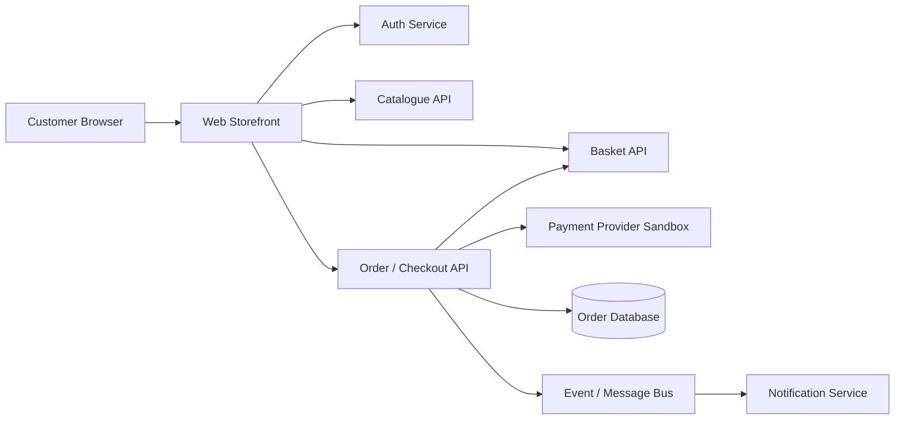
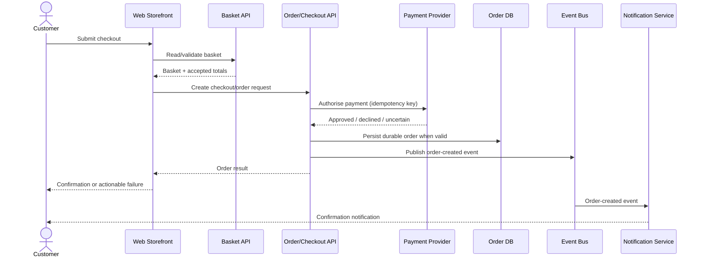

# ShopSphere – Logical Architecture

## Context Diagram

The diagram is purposefully abstracted from any concrete architecture. The quality strategy focuses on behavioral properties and failure modes as opposed to prescribing any concrete cloud or deployment architecture.

## Capability to Component Mapping

| Capability | Primary  technical components | Significant dependencies |
|---|---|---|
| **CAP-01 Authentication and Account Access** | Web Storefront, Auth Service | session/token storage, account data |
| **CAP-02 Product Discovery** | Web Storefront, Catalogue API | product data source/cache |
| **CAP-03 Basket Management** | Web Storefront, Basket API | catalogue price/availability |
| **CAP-04 Checkout and Payment** | Web Storefront, Order/Checkout API | Basket API, Payment Provider |
| **CAP-05 Order Fulfillment and Confirmation** | Order API, Order DB, Event Bus, Notification Service | payment result, messaging infrastructure |

It is useful since a single business capability can span multiple components. Testing at the service-level alone would be inadequate for some of the high-risk failure modes.

## Critical Purchase Sequence

A key architectural risk is the case of an uncertain payment response. In the case that there is a provider timeout after processing the request, ShopSphere cannot unconditionally trigger a second payment or order attempt. It influences requirements for idempotency, reconciliation, integration testing, and observability.

## Test seams

The architecture specifies the following testing boundaries:

- **Component/unit level:** pricing logic, validation, state transition, idempotency logic, and failure mappings.
- **API/Service level:** authentication, catalogue, basket, checkout, order contracts, and authorization rules.
- **Integration level:** order storage, payment provider responses, message publish/subscribe, and reconciliation logic.
- **UI end-to-end:** a carefully selected set of critical customer journeys designed to ensure proper functioning of the web app across services.
- **Performance:**  catalog/search reads, basket operations, checkout, and order creation under representative load.
- **Resilience:** scenarios involving timeouts by the provider, dependency failures, retry behavior, duplicate messages, and eventual consistency.
- **Observability:** correlation IDs and proof of a traceable customer transaction through services.

## Which risk types should be tested where

| Risk type | Best-fit primary test seam | Reasoning |
|---|---|---|

| Pricing logicpermutations | Component/API | many cases with quick deterministic feedback |
| Unauthorized access to order details | API/Service | direct authorization boundary test |
| Payment timeout and retry behavior | Integration | requires proper semantic interactions across boundaries |
| Duplicate event processing | Integration/Component | idempotency is deterministically testable |
| Customer checkout flow | UI end-to-end | browser behavior and cross-system orchestration are significant |
| Search operation latency | Performance/API | extra noise introduced by the browser timing |

## Quality implications

The UI is not the only place for ensuring business behavior. Most of the deterministic cases should be tested under the browser layer. UI automation testing should only be done for high-value flows that depend on customer-facing integration of multiple components.
