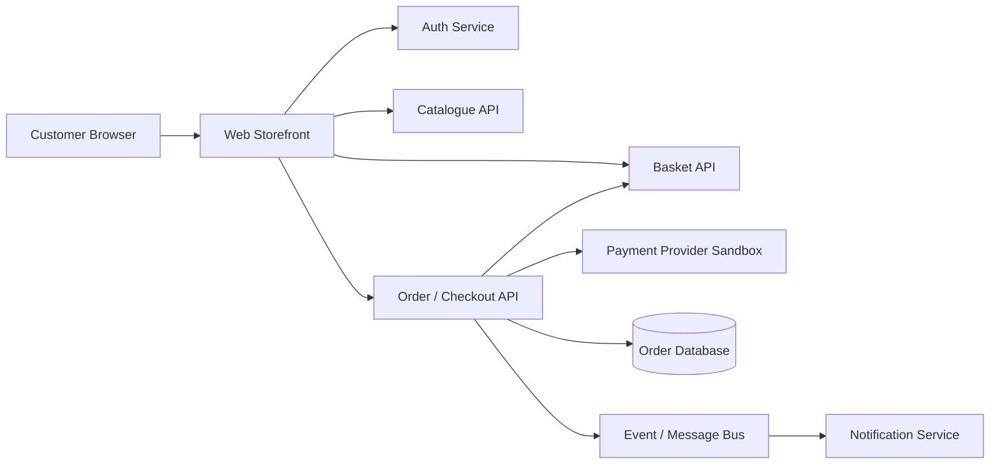
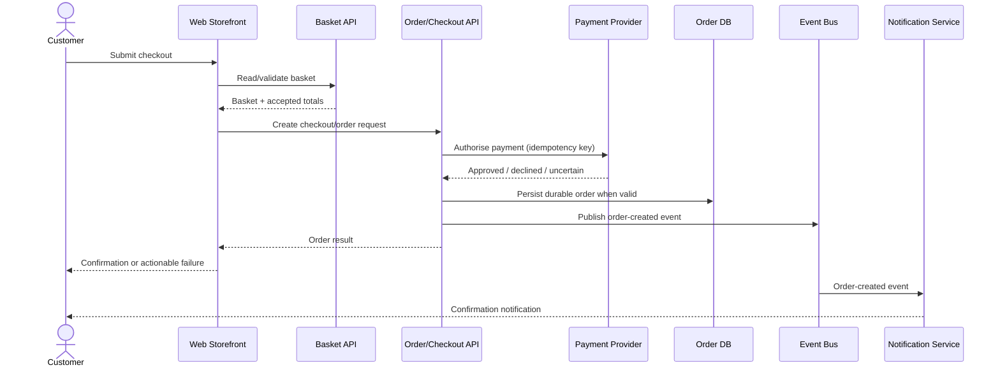

# ShopSphere — Logical Architecture

## System context

The diagram is deliberately logical rather than infrastructure-specific. The quality strategy is concerned with behaviour and failure boundaries, not with prescribing a particular cloud or deployment topology.

## Capability-to-component view

| Capability | Main technical components | Important dependencies |
|---|---|---|
| **CAP-01 Authentication & Account Access** | Web Storefront, Auth Service | session/token storage, account data |
| **CAP-02 Product Discovery** | Web Storefront, Catalogue API | product data source/cache |
| **CAP-03 Basket Management** | Web Storefront, Basket API | catalogue price/availability |
| **CAP-04 Checkout & Payment** | Web Storefront, Order/Checkout API | Basket API, Payment Provider |
| **CAP-05 Order Fulfilment & Confirmation** | Order API, Order DB, Event Bus, Notification Service | payment result, messaging infrastructure |

This mapping is useful because one business capability may span several components. Testing only individual services would therefore be insufficient for some high-risk failure modes.

## Critical purchase sequence

The most important architecture risk occurs around an **ambiguous payment result**. If the provider times out after processing the request, ShopSphere must not blindly create another payment or order on retry. That drives idempotency, reconciliation, integration testing, and observability requirements.

## Test seams

The architecture provides several useful test boundaries:

- **Component/unit level:** pricing calculations, validation, state transitions, idempotency rules, and error mapping.
- **API/service level:** authentication, catalogue, basket, checkout, order contracts, and authorization rules.
- **Integration level:** order persistence, payment-provider responses, message publication/consumption, and reconciliation behaviour.
- **UI end-to-end:** a deliberately small set of critical customer journeys that prove the browser experience across services.
- **Performance:** catalogue/search reads, basket operations, checkout, and order creation under representative load.
- **Resilience:** provider timeout, dependency unavailability, retry, duplicate message, and eventual-consistency scenarios.
- **Observability:** correlation IDs and evidence that allow one customer transaction to be followed across services.

## Where different risks should be tested

| Risk type | Strongest primary test seam | Why |
|---|---|---|
| Pricing permutations | Component/API | many combinations, fast deterministic feedback |
| Unauthorized order access | API/service | direct authorization boundary |
| Payment timeout and retry | Integration | requires real interaction semantics across boundary |
| Duplicate event consumption | Integration/component | idempotency can be exercised deterministically |
| Customer checkout journey | UI E2E | browser behaviour and cross-system orchestration matter |
| Search latency | Performance/API | browser timing adds unnecessary noise |

## Quality implication

The UI is not the only place to test business behaviour. Most deterministic combinations should be verified below the browser layer. UI automation is reserved for high-value journeys where confidence depends on the user-facing integration of several components.
